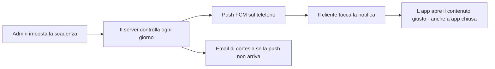

<div align="center">

# 📱 Portale PFC Mobile

**L'app Android riservata ai clienti dello studio.**
Documenti, messaggi, scadenze e notifiche — sempre aggiornati, in un unico posto.


</div>

---

## 📖 Indice

- [✨ Funzionalità](#-funzionalità)
- [🛠 Tecnologie](#-tecnologie)
- [🧭 Come funziona](#-come-funziona)
- [🚀 Sviluppo locale](#-sviluppo-locale)
- [📲 Installare l'app sul telefono](#-installare-lapp-sul-telefono)
- [🤖 CI/CD automatica](#-cicd-automatica)
- [📂 Struttura del progetto](#-struttura-del-progetto)
- [🔢 Versioni](#-versioni)
- [🔒 Sicurezza e privacy](#-sicurezza-e-privacy)
- [🧯 Risoluzione problemi](#-risoluzione-problemi)

---

## ✨ Funzionalità

### 📁 Archivio documenti

I documenti dello studio sono organizzati per **anno → cartella → file**. Gli anni stanno nei chip in alto (sempre uno selezionato, di default il più recente) e la lista mostra subito le cartelle: nessun passaggio inutile. La ricerca è globale e trova un documento da qualunque punto dell'app. Ogni file si apre in un'**anteprima PDF integrata** e può essere segnato come preferito, scaricato sul telefono o condiviso. Il pulsante oro **«I miei preferiti»** apre il pannello con tutti i preferiti di ogni anno e, se lo studio sposta o rinomina un documento, l'app lo ritrova da sola — stellina compresa.

- Ricerca globale tra tutti i documenti
- Preferiti e download singoli
- **Selezione multipla**: download e preferiti in blocco
- **Auto-aggiornamento silenzioso**: l'archivio si aggiorna da solo all'ingresso nella scheda e quando arriva una notifica, senza "trascina in basso" e senza interrompere ciò che stai guardando

### 💬 Messaggi

Le comunicazioni dallo studio arrivano nella scheda Messaggi, con la possibilità di rispondere allegando file e di archiviare i thread conclusi. La campanella in alto si aggiorna da sola e si pulisce quando i contenuti vengono letti.

### 🗂 Cassetto personale

Uno spazio privato per i documenti del cliente: caricamento, download, rinomina ed eliminazione di file personali (QR P.IVA, visure, IBAN e simili), sempre disponibili su ogni dispositivo.

### 📋 Attività

Il registro delle operazioni svolte: ogni azione rilevante lascia traccia, in ordine cronologico, così il cliente ha sempre sott'occhio cosa è successo e quando.

### 🔔 Notifiche intelligenti

Le notifiche sono il cuore del portale e funzionano su due binari:

- **Push dal server** (Firebase Cloud Messaging, canale dedicato): avvisi di nuovi documenti, messaggi e scadenze
- **Promemoria locale delle scadenze**: una rete di sicurezza dell'app stessa, che ricorda la scadenza il giorno stesso

Il tocco su una notifica apre **direttamente il contenuto giusto** — il documento, il messaggio o la scadenza — anche se l'app era chiusa. In Impostazioni c'è **un solo interruttore**: acceso, tutto arriva come da logica; spento, il telefono viene tolto dal registro e non arriva più nulla, nemmeno a app chiusa. Una pillola di stato mostra sempre la situazione: **Attivo** (verde) o **Non attivo** (ambra).

### ⚙️ Impostazioni essenziali

Il pannello delle impostazioni mostra solo ciò che serve: il profilo con le iniziali e lo stato ("Cliente Attivo"), l'interruttore delle notifiche con la sua pillola di stato, i promemoria delle scadenze, il tema e l'uscita dall'account con conferma. Niente dati tecnici, niente pulsanti di diagnostica.

### 🎨 Grafica "Midnight Sapphire & Champagne Gold"

Un design system dedicato: blu notte come primario, oro champagne come accento, supporto **tema chiaro, scuro e di sistema** (persistente). Icone vettoriali, feedback aptici e skeleton di caricamento su tutte le schede.

---

## 🛠 Tecnologie

| Area | Tecnologia |
|---|---|
| Framework | React Native 0.76 · Expo SDK 52 (dev-client) |
| Linguaggio | TypeScript 5.6 |
| Stato | Zustand 5 |
| Navigazione | React Navigation 7 (bottom tabs + stack + modali globali) |
| Notifiche push | Firebase Cloud Messaging (`@react-native-firebase/messaging`) |
| Notifiche locali | expo-notifications (promemoria scadenze) |
| Documenti | react-native-pdf · react-native-blob-util · expo-file-system · expo-sharing |
| Extra | biometria, feedback aptico, document picker, mail composer, react-native-svg |
| Grafica | Design system dedicato, light + dark mode |
| Backend | `portale-pfc-v2` (Vercel + Prisma) — repository separato |

---

## 🧭 Come funziona

L'app è il **client Android** del portale: si collega al backend (`portale-pfc-v2`, su Vercel) tramite un client API con sessione a cookie. Il backend è il depositario della logica: gli utenti, i documenti, i messaggi e — soprattutto — **le scadenze**.

Le scadenze funzionano così: in admin si sceglie l'anticipo in giorni per ogni scadenza; il server controlla ogni giorno e invia la notifica push quando mancano pochi giorni, **ritentando finché non risulta consegnata**; solo negli ultimi due giorni, se la push non è arrivata, parte una email di cortesia (una volta sola). L'app aggiunge la rete di sicurezza del promemoria locale il giorno stesso della scadenza.



---

## 🚀 Sviluppo locale

### Requisiti

- Node.js ≥ 20
- JDK 17 · Android SDK 34 (Android Studio)
- Un device fisico con USB debugging (consigliato) o un emulatore
- `google-services.json` del progetto Firebase **portale-pfc-v3** in `android/app/` (presente in locale, **non** è nella repo per sicurezza)

### Primi passi

```bash
npm install

# Prima volta (build nativa + install sul device):
npx expo run:android --device

# Tutte le altre volte (hot reload, nessuna ricompilazione):
npx expo start --dev-client
```

> ⚠️ L'app **non funziona in Expo Go**: usa moduli nativi (Firebase, biometria, PDF).
> Il dev-client installa una build di sviluppo standalone; dopo la prima build,
> per il codice JS/TS basta Metro con hot reload.

### Comandi utili

| Comando | Descrizione |
|---|---|
| `npm run typecheck` | Controllo TypeScript (`tsc --noEmit`) |
| `npm run lint` | ESLint |
| `npm run android:device` | Build + install sul device USB |
| `npm run build:android` | APK release locale (`android/gradlew assembleRelease`) |
| `npm run clean:android` | Pulizia build Gradle |

---

## 📲 Installare l'app sul telefono

**Modo 1 — APK pronta da GitHub (consigliato)**

1. Apri il repository → **Releases** → `latest-apk`
2. Scarica `app-release.apk`
3. Installa: sovrascrive la versione precedente e **mantiene login e impostazioni**

**Modo 2 — Build locale**

```bash
npm run build:android
# APK in android/app/build/outputs/apk/release/
```

---

## 🤖 CI/CD automatica

Ad ogni push, il workflow `.github/workflows/ci.yml` esegue due job in sequenza:

1. **Verify** — `npm ci`, controllo TypeScript (`tsc --noEmit`) ed ESLint
2. **Build release APK** (solo se Verify passa) — JDK 17 temurin + Android SDK, ricostruzione di `google-services.json` dal secret `GOOGLE_SERVICES_B64`, `./gradlew assembleRelease`, pubblicazione dell'APK sulla release **`latest-apk`** con la versione letta da `package.json`

Risultato: ogni push su `main` produce un APK installabile, sempre aggiornato, senza passaggi manuali.

### Setup su una repo nuova (una volta sola)

`google-services.json` non è nella repo: la CI lo ricrea da un secret.

```bash
# Con GitHub CLI (gh) autenticato:
gh secret set GOOGLE_SERVICES_B64 < <(base64 -w0 android/app/google-services.json)
```

PowerShell (senza gh, dalla web UI: repo → Settings → Secrets and variables → Actions):

```powershell
[Convert]::ToBase64String([IO.File]::ReadAllBytes("android\app\google-services.json")) | Set-Clipboard
# incolla il valore nel secret GOOGLE_SERVICES_B64
```

---

## 📂 Struttura del progetto

```
├── App.tsx                    # Bootstrap: sessione, push, polling badge
├── app.json                   # Config Expo (slug, package android, versione)
├── src/
│   ├── api/client.ts          # API client (cookie sessione, tutti gli endpoint)
│   ├── components/            # UI riutilizzabile
│   │   ├── TopBar.tsx         # Barra superiore con monogramma e campanella
│   │   ├── Modal.tsx          # Foglio modale condiviso (tocco fuori = chiudi)
│   │   ├── ConfirmDialog.tsx  # Conferme (uscita, azioni destructive)
│   │   ├── Toaster.tsx        # Messaggi di feedback
│   │   ├── Skeleton.tsx       # Segnaposto di caricamento
│   │   └── ...                # Badge, Button, Card, EmptyState, FileIcon, Input
│   ├── lib/
│   │   ├── push.ts            # Registrazione FCM, rispetta l'interruttore notifiche
│   │   ├── notifiche.ts       # Notifiche locali e canale di notifica
│   │   ├── scadenze-locali.ts # Promemoria scadenze (rete di sicurezza locale)
│   │   ├── deeplink.ts        # Apertura del contenuto giusto dalla notifica
│   │   ├── download.ts        # Download e apertura file
│   │   ├── condividi.ts       # Condivisione documenti
│   │   ├── haptics.ts         # Feedback aptico
│   │   └── utils.ts           # Utilità condivise
│   ├── navigation/            # AppNavigator (tabs + stack + modali globali)
│   ├── screens/
│   │   ├── LoginScreen.tsx    # Accesso
│   │   ├── ArchivioScreen.tsx # Archivio per anno/cartella/file
│   │   ├── MessaggiScreen.tsx # Comunicazioni dallo studio
│   │   ├── CassettoScreen.tsx # Documenti personali
│   │   ├── AttivitaScreen.tsx # Registro attività
│   │   ├── PdfPreviewScreen.tsx # Anteprima PDF integrata
│   │   ├── NotificheModal.tsx # Centro notifiche in-app
│   │   ├── SettingsModal.tsx  # Impostazioni (profilo, notifiche, tema)
│   │   ├── OnboardingScreen.tsx # Primo avvio
│   │   └── SplashScreen.tsx   # Schermata iniziale
│   ├── store/auth.ts          # Store globale (Zustand)
│   ├── theme/colors.ts        # Design system: palette light + dark
│   └── types/api.ts           # Tipi API condivisi
└── android/                   # Progetto nativo (prebuild manuale)
```

---

## 🔢 Versioni

La versione vive in tre punti, tenuti allineati:

1. `app.json` → `expo.version`
2. `package.json` → `version`
3. `android/app/build.gradle` → `versionName` / `versionCode`

Per pubblicare una nuova versione: incrementa `versionName` (es. `1.23.0`) e `versionCode` (sempre +1) in `android/app/build.gradle`, allinea gli altri due file e fai push — la CI pubblica la nuova APK su GitHub Releases.

### Ultime versioni

| Versione | App | Novità principali |
|---|---|---|
| **v4.22** | 1.22.0 | Bacheca rifinita: la X del pannello è allineata al titolo (come nella scheda), via il pulsante "Chiudi" — la chiusura resta con la X, il tocco fuori o il trascinamento giù |
| **v4.21** | 1.21.0 | Bacheca senza date e con la chiusura più comoda (richieste del titolare) |
| **v4.20** | 1.20.0 | Bacheca delle Comunicazioni: scheda elegante oro/blu al posto dei cartelli gialli, elenco completo in un pannello dal basso, la notifica push apre direttamente la Bacheca, pallino NUOVO sulle novità, tema scuro supportato |
| **v4.19** | 1.19.0 | Gli avvisi pubblici dello studio arrivano anche in app: sempre visibili sotto la barra in alto su ogni schermata, aggiornati in tempo reale; siti internet cliccabili negli avvisi e nei messaggi |
| **v4.18** | 1.18.0 | Niente più doppioni: "Scarica" e "Condividi" sempre insieme, anche nel lettore PDF; via la voce email dedicata (col pannello Condividi la email la fai già, scegliendo Gmail/mail) |
| **v4.17** | 1.17.0 | I preferiti si curano da soli: file spostato o rinominato viene ritrovato automaticamente (riprova, stesso nome, nome simile); solo se sparito davvero compare una schermata chiara con ricerca e rimozione dai preferiti |
| **v4.16** | 1.16.0 | Fine del 404 criptico: riparazione automatica dei preferiti rotti; il file scaricato mantiene il SUO nome (non più "download completato"); scheda file essenziale (Percorso + Dimensione) |
| **v4.15** | 1.15.0 | Archivio ordinato: "3 cartelle" (non più sezioni), via le diciture di aggiornamento, pulsante oro "I miei preferiti (n)", preferiti sempre in cima, stati veri al tocco (apri = visto, scarica = scaricato) |
| **v4.14** | 1.14.0 | Schermata di accesso ripensata: respirata e centrata, occhietto per mostrare/nascondere la password, logo invariato |
| **v4.13** | 1.13.0 | Interruttore notifiche vero (acceso = tutto arriva, spento = nulla più), pillola Attivo/Non attivo sempre coerente, via @username e versione app, scroll fluido in tutti i pannelli |
| **v4.12** | 1.12.0 | Archivio ripensato: anni solo nei chip, cartelle subito visibili, auto-aggiornamento silenzioso, apertura più veloce; Impostazioni stile v4 |
| **v4.11** | 1.11.0 | Grafica completa v4: palette Midnight Sapphire & Champagne Gold, TopBar con monogramma, interni di tutte le schede rifatti (logica invariata) |
| **v4.7** | 1.7.0 | Il tocco sulle notifiche apre il contenuto giusto, anche a app chiusa; campanella che si aggiorna e si pulisce da sola |

---

## 🔒 Sicurezza e privacy

- **Nessun segreto nella repo**: `google-services.json` è ricreato in CI da un secret GitHub (`GOOGLE_SERVICES_B64`)
- **Sessione a cookie** gestita dal backend, con logout e audit log lato server
- **Accesso riservato**: l'app è destinata ai clienti dello studio; le notifiche seguono l'interruttore scelto dal cliente, che può spegnerle in qualsiasi momento
- **Nessun dato tecnico esposto nell'UI**: token e diagnostica vivono nel codice, non a schermo

---

## 🧯 Risoluzione problemi

| Problema | Soluzione |
|---|---|
| Metro non si collega al device | Stessa rete Wi-Fi o `adb reverse tcp:8081 tcp:8081`; riavvia con `npx expo start --dev-client --clear` |
| Errore Firebase su build nuova | Verifica che `android/app/google-services.json` esista e contenga package `com.portalepfcrn` |
| Non arrivano notifiche | Apri **Impostazioni**: la pillola deve dire **Attivo** (verde). Se dice Non attivo, accendi l'interruttore "Ricevi gli avvisi dello studio": il telefono viene registrato automaticamente e la pillola diventa verde |
| Kotlin/compose errori in build | Assicurati che `android/build.gradle` abbia `kotlinVersion = "2.0.21"` e il classpath esplicito `kotlin-gradle-plugin:2.0.21` |
| Gradle cache corrotta | `cd android && ./gradlew clean` oppure elimina `android/.gradle` |

---

## 📄 Licenza

Progetto a uso interno dello studio — tutti i diritti riservati.
